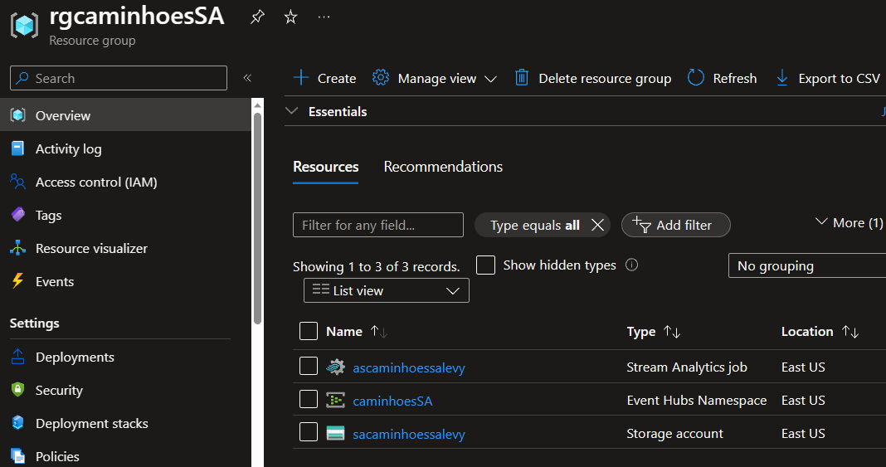
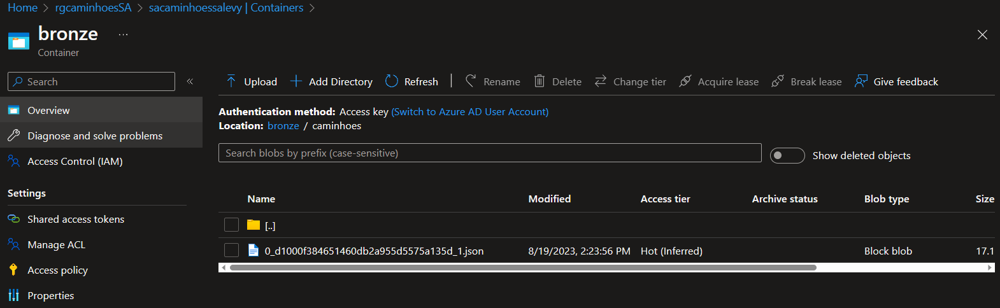

# Projeto de Engenharia de Dados - Streaming de Dados

# IGA Caminhões SA

## Contexto e Objetivos do Projeto

A IGA Caminhões SA, uma empresa fictícia especializada em transporte de alimentos refrigerados, está embarcando em um projeto estratégico de monitoramento de temperatura dentro de seus caminhões frigoríficos. A empresa reconhece a importância crítica de manter as temperaturas dentro dos caminhões em níveis ideais para garantir a qualidade e a segurança dos produtos transportados. Com o objetivo de aprimorar seu processo de monitoramento, a IGA Caminhões SA está investindo em um sistema de engenharia de dados que permitirá a coleta e análise em tempo real dos dados de temperatura.

## Descrição do Projeto

O objetivo deste projeto é criar um pipeline de dados para a ingestão em tempo real de informações de sensores de temperatura instalados em caminhões frigoríficos da empresa IGA Caminhões SA. Esses sensores monitoram constantemente a temperatura dentro dos caminhões, garantindo a integridade dos alimentos refrigerados durante o transporte. Os dados coletados pelos sensores são transmitidos em tempo real para um sistema central de análise.

## Arquitetura

Para a implementação deste projeto, utilizamos uma arquitetura baseada na plataforma Azure da Microsoft, aproveitando as seguintes tecnologias:

- **Azure Event Hubs**: O Azure Event Hubs é o ponto de entrada para os dados provenientes dos sensores dos caminhões. Este serviço atua como um hub de eventos altamente escalável, permitindo a ingestão, processamento e armazenamento de informações em tempo real. Os dados são recebidos aqui a partir dos sensores e encaminhados para a próxima etapa do pipeline.

- **Azure Stream Analytics**: O Azure Stream Analytics é responsável por realizar análises em tempo real nos dados recebidos. Ele processa milhões de eventos de streaming por segundo, permitindo que a equipe de monitoramento da IGA Caminhões SA identifique imediatamente qualquer desvio nas temperaturas dos caminhões frigoríficos. Caso sejam detectadas anomalias, ações corretivas podem ser acionadas em tempo hábil.

- **Azure Data Lake Storage Gen2**: Os dados são armazenados no Azure Data Lake Storage Gen2. Este sistema de arquivos corporativo é otimizado para análises de big data, suportando uma variedade de cargas de trabalho, incluindo processamento com Hadoop, Spark e outras ferramentas. O Data Lake armazena um histórico completo dos dados de temperatura, o que é valioso para análises retrospectivas e tendências ao longo do tempo.

## Conclusão

Este projeto de engenharia de dados de streaming atende aos objetivos estratégicos da IGA Caminhões SA, proporcionando à empresa uma maneira eficiente de monitorar e registrar as temperaturas dentro de seus caminhões frigoríficos em tempo real. A capacidade de resposta imediata a qualquer anomalia nas temperaturas é crucial para garantir a qualidade e segurança dos produtos transportados. Este sistema também permite análises retrospectivas para melhorar ainda mais as operações da empresa. O próximo passo pode ser a integração de um dashboard de análise, conforme as necessidades da IGA Caminhões SA evoluem.